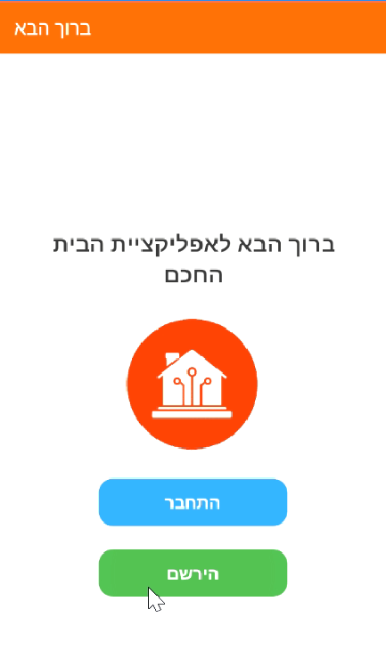
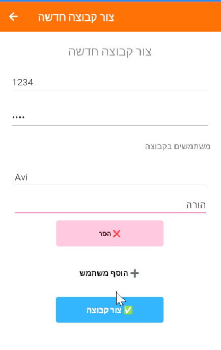
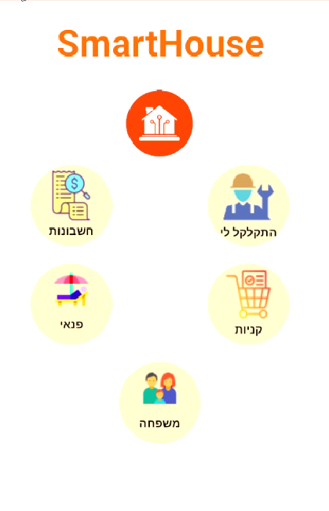

# 🏡 SmartHouse – Household Management App

## Overview

Have you ever forgotten your router password? Discovered you forgot to pay the building maintenance fee? Or found yourself wondering - how much did I pay for internet last month? Did they raise the price?! And what was that technician's name? Moshe?

In the modern era, managing a household has become a complex task: electricity, water, building maintenance, and rent payments; recurring maintenance tasks; weekly and monthly shopping lists – and everything is scattered across digital calendars, reminder apps, and sticky notes.

SmartHouse is a **cross-platform mobile app** built with **Xamarin.Forms (C#)** for Android. The app centralizes all household management tasks in one place with a modern and intuitive UI.

<div align="center">
  
  
  
</div>

## ✨ Features

- 📊 **Utilities Tracking** – Monitor bills and usage (water, electricity, gas)
- 🛒 **Shopping List** – Shared lists for the whole family
- ✅ **Task Assignments** – Assign and track daily chores for children and family members
- 🎯 **Bucket List** – Keep track of family goals and achievements
- 🔐 **Authentication** – Secure user login with Firebase
- 💾 **Cloud Storage** – All data stored and synced with Firebase

## 🏗️ Architecture & Design

- Cross-platform development with **Xamarin.Forms**
- **Shell Navigation** with Flyout Page and custom transitions
- Integrated with **Firebase** for data sync and cloud storage
- Applied the **Strategy Design Pattern** to handle different household task types, ensuring clean, scalable code
- Modern UI/UX with custom icons, consistent styling, and bilingual support (English/Hebrew)

## 🛠️ Tech Stack

| Component | Technology |
|-----------|------------|
| **Mobile App** | Xamarin.Forms (C#) |
| **Database** | Firebase |
| **Architecture** | MVVM, Strategy Pattern |
| **IDE** | Visual Studio Code |

## 📱 Screenshots

_[Add your screenshots here]_

## 🚀 Getting Started

### Prerequisites
- Visual Studio Code
- Xamarin.Forms SDK
- Android SDK and Android Emulator (AMD)

### Installation

1. **Clone the repository**
   ```bash
   git clone https://github.com/Gavri8827/SmartHouse.git
   ```

2. **Open the project in Visual Studio Code**
   ```bash
   cd smarthouse
   code .
   ```

3. **Configure Firebase**
   - Add your `google-services.json` file to the Android project
   - Update Firebase configuration settings

4. **Build and run the project**
   - Start Android Emulator (AMD)
   - Open the solution file (`.sln`) in Visual Studio Code
   - Run the project from VS Code

## 🤝 Contributing

Contributions, issues, and feature requests are welcome! 

</div>
